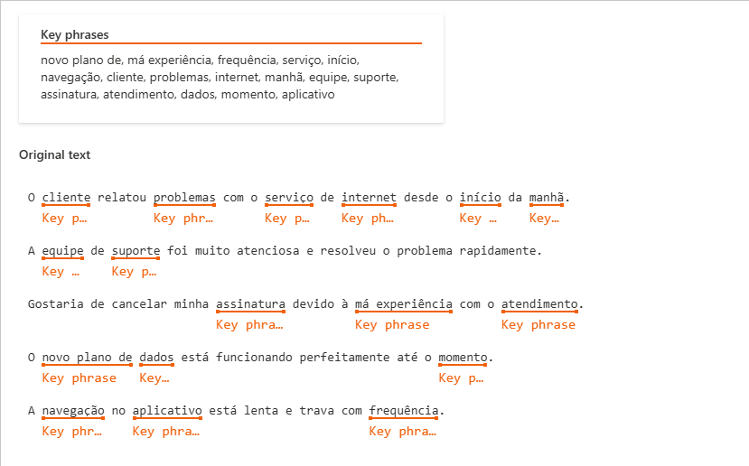
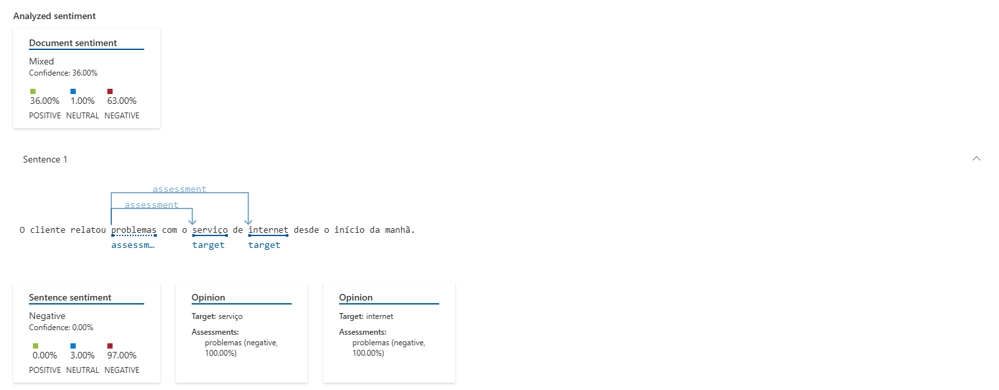
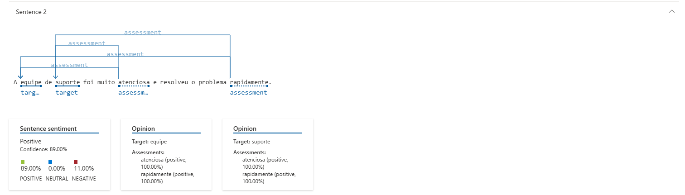
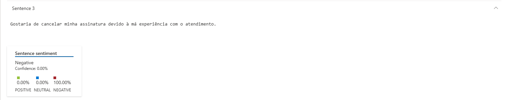
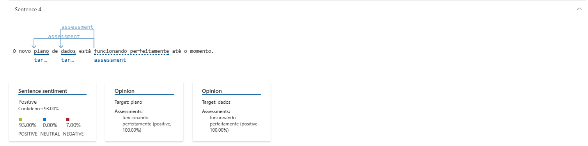
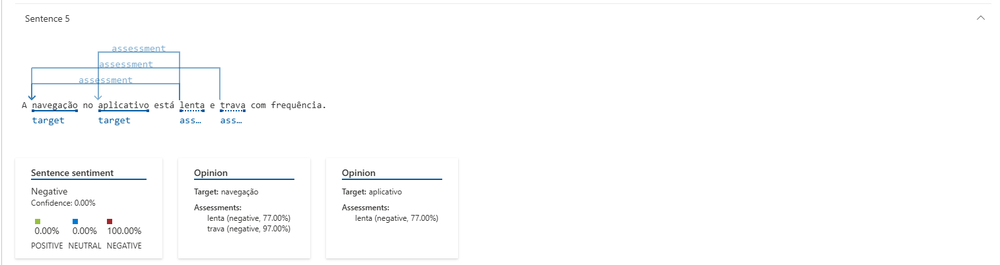
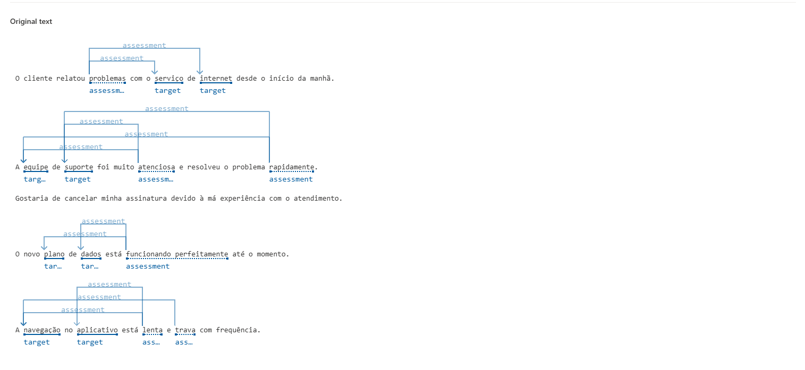

# Análise de Sentenças com IA

## Objetivo

Este projeto tem como objetivo aplicar técnicas de **Processamento de Linguagem Natural (NLP)** usando **serviços de IA**, como os oferecidos pelo **Azure Language Studio**, para analisar frases e extrair insights.

---

## Estrutura

- `inputs/sentences.txt` → Contém frases reais simuladas para análise
- `prints/` → Capturas de tela do Language Studio
- `README.md` → Documentação do processo e aprendizados

---

## Processo

1. Utilizei o [Language Studio](https://language.cognitive.azure.com) da Microsoft Azure.
2. Criei um recurso do tipo **Linguagem (F0 gratuito)** chamado `linguagem-felipe`.
3. Acessei os seguintes recursos:
   - **Extração de frases-chave**
   - **Análise de sentimento**
4. Registrei os resultados e insights obtidos para documentação.

---

## Resultados da Análise – Extração de Frases-Chave

A IA foi capaz de identificar os pontos centrais em cada frase, como mostrado abaixo:

### Frases-chave extraídas:
- novo plano de dados  
- má experiência  
- serviço de internet  
- atendimento  
- aplicativo  
- navegação  
- suporte  

Essas frases destacam claramente os **principais temas abordados**, como problemas técnicos, atendimento e experiência do cliente.

---

## Resultados da Análise – Sentimento

A IA do Azure também classificou o **sentimento de cada frase**, identificando emoções como positiva, negativa ou mista. Abaixo estão os resultados visuais da análise:

### Sentimentos Identificados:

#### Frase 1:
*"O cliente relatou problemas com o serviço de internet desde o início da manhã."*  
- Resultado: **Negativo (97%)**  
- 

#### Frase 2:
*"A equipe de suporte foi muito atenciosa e resolveu o problema rapidamente."*  
- Resultado: **Positivo (89%)**  
- 

#### Frase 3:
*"Gostaria de cancelar minha assinatura devido à má experiência com o atendimento."*  
- Resultado: **Negativo (100%)**  
- 

#### Frase 4:
*"O novo plano de dados está funcionando perfeitamente até o momento."*  
- Resultado: **Positivo (93%)**  
- 

#### Frase 5:
*"A navegação no aplicativo está lenta e trava com frequência."*  
- Resultado: **Negativo (100%)**  
- 

---

### 📊 Visão Geral:

---

## 💡 Insights e Aprendizados

- A **extração de frases-chave** ajudou a identificar os **temas mais recorrentes** nas sentenças.
- A **análise de sentimento** mostrou como a IA pode **classificar emoções com precisão** com base em padrões linguísticos.
- É possível aplicar essas análises para **entendimento automático de feedbacks**, **priorização de reclamações** e **monitoramento da experiência do usuário em tempo real**.

---

